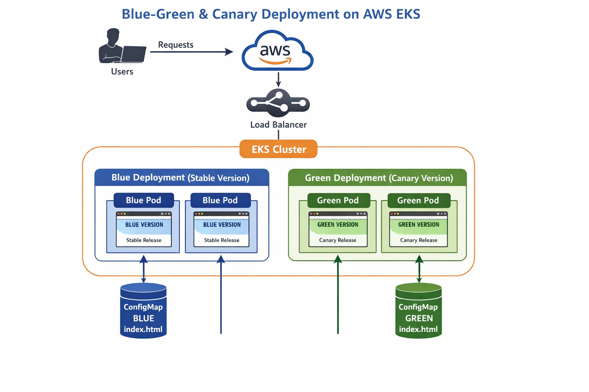

# 🚀 Kubernetes Blue-Green & Canary Deployment on AWS EKS

## 📌 Project Overview

This project demonstrates a **production-style deployment strategy in Kubernetes** using **Blue-Green and Canary deployments** on **AWS EKS**.

The goal is to release new application versions **safely with zero downtime** while ensuring a smooth user experience.

By running **multiple versions simultaneously**, traffic can be gradually shifted from the stable version to the new version.


## 🎯 Key Objectives

- Zero downtime during application updates  
- Gradual rollout of new versions
- Safe testing of new releases in production  
- Easy rollback in case of failures  
- Visual verification using different web pages  


## 🏗 Deployment Strategy

### 🔵 Blue Deployment (Stable Version)
The **Blue environment** represents the current stable version of the application that is actively serving users.

### 🟢 Green Deployment (New Version)
The **Green environment** represents the new application version that is gradually introduced.

### 🐤 Canary Release
In the **Canary deployment strategy**, only a small portion of traffic is directed to the new version initially.  
If the new version performs well, traffic is slowly increased until it fully replaces the old version.

Traffic distribution in this project is controlled by **changing the number of running pods**.


## 🏛 Architecture Overview

User Request  
↓  
AWS LoadBalancer Service  
↓  
Kubernetes Service  
↓  
Blue Pods (Stable Version)  
Green Pods (Canary Version)

Traffic is automatically distributed across pods based on Kubernetes service routing.




## 🧰 Tools & Technologies

| Tool | Purpose |
|-----|--------|
| **AWS EC2 (Ubuntu)** | DevOps jump server |
| **AWS EKS** | Managed Kubernetes cluster |
| **kubectl** | Kubernetes command line tool |
| **eksctl** | Tool for creating and managing EKS clusters |
| **NGINX** | Web server used inside containers |
| **ConfigMaps** | Used to inject different HTML pages |
| **LoadBalancer Service** | Exposes the application publicly |


## 📂 Project Structure
```
eks-blue-green-canary/

├── blue-deployment.yaml
├── green-canary.yaml
├── service.yaml
├── blue-index.html
├── green-index.html
└── README.md
```


### Step 1: Launch Ubuntu EC2 (Jump Server)

1. Launch **Ubuntu Server 22.04 LTS**
2. Instance type: `t3.medium`
3. Allow ports: `22`, `80`
4. Attach IAM role with `AdministratorAccess`
5. Connect using SSH

```bash
ssh -i eks-key.pem ubuntu@<EC2_PUBLIC_IP>
```
---
### Step 2: Install Required Tools on EC2
__Update system__
```bash
sudo apt update && sudo apt upgrade -y
```

__Install AWS CLI__
```bash
sudo apt install unzip curl -y
curl https://awscli.amazonaws.com/awscli-exe-linux-x86_64.zip -o awscliv2.zip
unzip -o awscliv2.zip
sudo ./aws/install --update
```

__Install kubectl__
```bash
curl -LO https://dl.k8s.io/release/v1.29.0/bin/linux/amd64/kubectl
chmod +x kubectl
sudo mv kubectl /usr/local/bin/
```

__Install eksctl__
```bash
curl -sLO https://github.com/weaveworks/eksctl/releases/latest/download/eksctl_Linux_amd64.tar.gz
tar -xzf eksctl_Linux_amd64.tar.gz
sudo mv eksctl /usr/local/bin/
```


### Step 3: Create AWS EKS Cluster
```
eksctl create cluster \
--name blue-green-cluster \
--region ap-south-1 \
--nodegroup-name worker-nodes \
--node-type t3.medium \
--nodes 2
```


__Verify:__
```
kubectl get nodes
```


### Step 4: Create Blue Deployment (Stable Version)

```vim blue-deployment.yaml```
```
apiVersion: apps/v1
kind: Deployment
metadata:
  name: blue-app
spec:
  replicas: 4
  selector:
    matchLabels:
      app: myapp
      version: blue
  template:
    metadata:
      labels:
        app: myapp
        version: blue
    spec:
      containers:
      - name: nginx
        image: nginx:1.25
        ports:
        - containerPort: 80
        volumeMounts:
        - name: blue-html
          mountPath: /usr/share/nginx/html
      volumes:
      - name: blue-html
        configMap:
          name: blue-html
```
### Step 5: Create Green Canary Deployment (New Version)

```vim green-canary.yaml```
```
apiVersion: apps/v1
kind: Deployment
metadata:
  name: green-canary
spec:
  replicas: 1
  selector:
    matchLabels:
      app: myapp
      version: green
  template:
    metadata:
      labels:
        app: myapp
        version: green
    spec:
      containers:
      - name: nginx
        image: nginx:1.26
        ports:
        - containerPort: 80
        volumeMounts:
        - name: green-html
          mountPath: /usr/share/nginx/html
      volumes:
      - name: green-html
        configMap:
          name: green-html
```

### Step 6: Create index.html Files
__Blue Version__
```vim blue-index.html```
```
<!DOCTYPE html>
<html>
<head>
  <title>Blue Version</title>
</head>
<body style="background-color: lightblue;">
  <h1>🔵 BLUE VERSION</h1>
  <p>This is Blue (Stable) Deployment</p>
</body>
</html>
```
__Green Version__
```vim green-index.html```
```
<!DOCTYPE html>
<html>
<head>
  <title>Green Version</title>
</head>
<body style="background-color: lightgreen;">
  <h1>🟢 GREEN VERSION</h1>
  <p>This is Green (Canary) Deployment</p>
</body>
</html>
```

### Step 7: Create ConfigMaps
```
kubectl create configmap blue-html --from-file=index.html=blue-index.html
kubectl create configmap green-html --from-file=index.html=green-index.html
```

### Step 8: Create Kubernetes Service

```vim service.yaml```
```
apiVersion: v1
kind: Service
metadata:
  name: myapp-service
spec:
  selector:
    app: myapp
  ports:
    - port: 80
      targetPort: 80
  type: LoadBalancer
```
Apply all resources:
```
kubectl apply -f service.yaml
```
```
kubectl get all
```


### Step 9: Access Application
```
kubectl get svc myapp-service
```


Open in browser:
```
http://<EXTERNAL-IP>
```

Refresh multiple times to see Blue and Green pages.


### Step 10: Canary Traffic Control
Initial Canary

Blue: 4 pods

Green: 1 pod

Increase Canary to 50%
```
kubectl scale deployment green-canary --replicas=3
kubectl scale deployment blue-app --replicas=3
```
r
Full Promotion
```
kubectl scale deployment green-canary --replicas=6
kubectl scale deployment blue-app --replicas=0
```


### Step 11: Rollback (Zero Downtime)
```
kubectl scale deployment green-canary --replicas=0
kubectl scale deployment blue-app --replicas=4
```
Cleanup
```
eksctl delete cluster --name blue-green-cluster --region ap-south-1
```

## 📈 Real-World DevOps Relevance

This project reflects common practices used in **modern DevOps and cloud-native environments**, including:

- Safe production deployments  
- Incremental feature releases  
- Cloud-native application management  
- Kubernetes traffic control  

Such deployment strategies are widely used by companies to **reduce deployment risk and improve application reliability**.


## 📌 Conclusion

This project demonstrates how **Blue-Green and Canary deployment strategies** can be implemented using **Kubernetes on AWS EKS**.

By combining container orchestration with controlled traffic distribution, teams can release new application versions **safely, efficiently, and with zero downtime**.

This makes the project a strong **DevOps portfolio and interview-ready implementation**.
